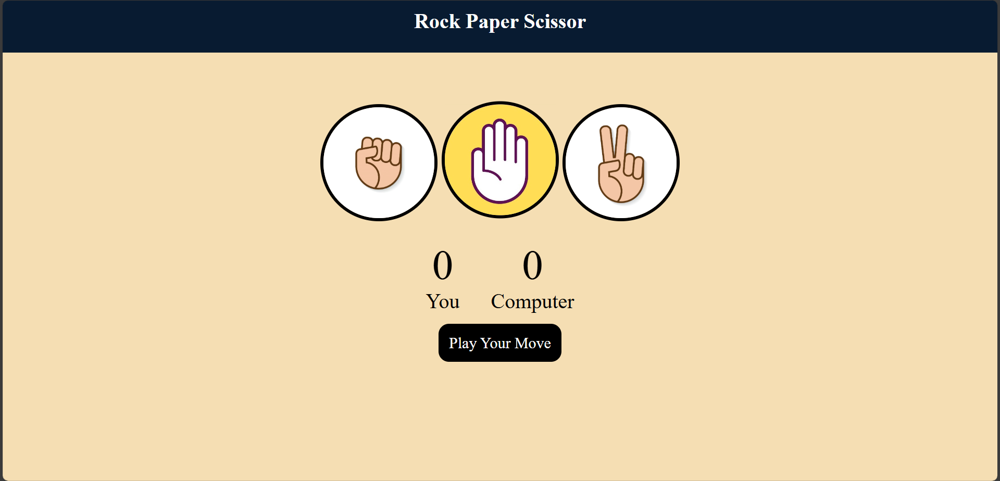
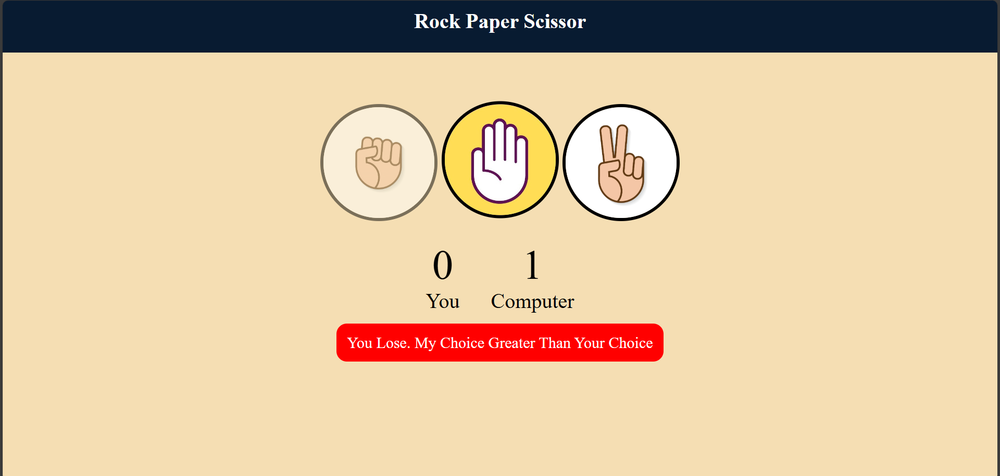
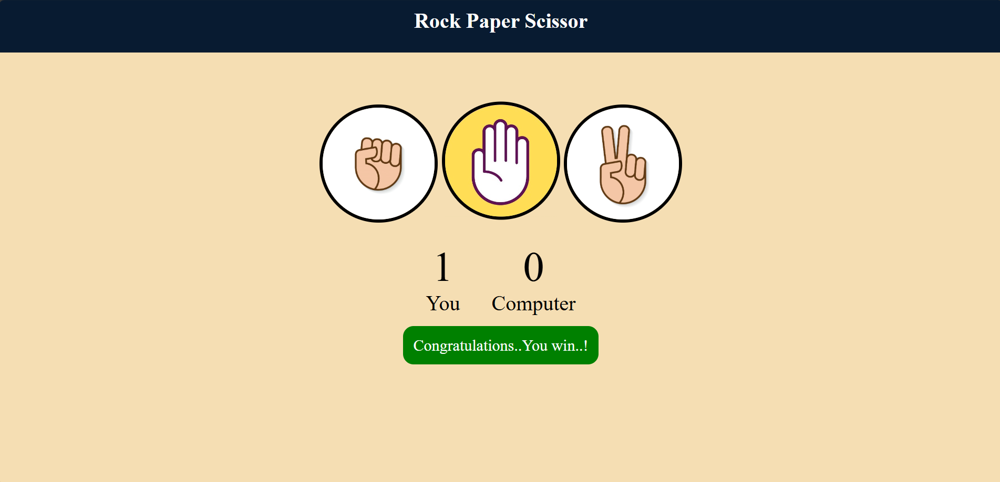

# 🎮 Rock–Paper–Scissors Game

A simple and interactive **Rock–Paper–Scissors** game created using **HTML, CSS, and JavaScript**.  
This project demonstrates basic game logic, DOM manipulation, event handling, and responsive UI design.

---

## 📸 Preview  

## Preveiw 1

## Preveiw 2

## Preveiw 3

---

## 🚀 Features
- 🪨📄✂️ Classic Rock–Paper–Scissors gameplay  
- 🎯 Real-time score updates  
- ⚡ Instant result display  
- 🎨 Clean and responsive UI  
- 🖱️ User click-based interaction  
- 🤖 Computer chooses randomly  

---

## 🛠️ Technologies Used
- **HTML5**
- **CSS3**
- **JavaScript**

---

## 📂 Project Structure

/rock-paper-scissors/
│── index.html
│── style.css
│── script.js
└── assets/ (images/icons)
└── Screenshots/ (Output)

---

## ▶️ How to Run

1. Clone the repository:
  
Open index.html in any browser.

---

## 🧑‍💻 Author
Aman Chougule
